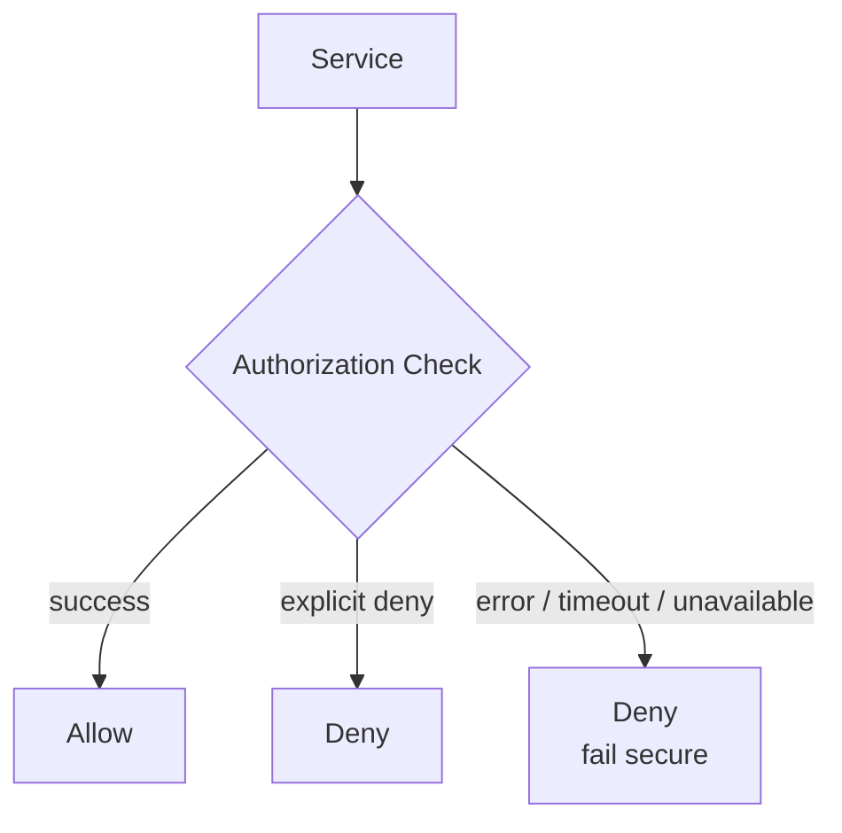

## Diagram

## Summary

Defines that when a security control fails — due to an error, timeout, or unavailable dependency — the system defaults to the most restrictive safe state (deny) rather than open access. The opposite, fail open, grants access when the control fails, which is convenient but creates an exploitable window. Fail Secure treats availability of the security control as a hard dependency, not an optimization.

## When To Use

- A security control (auth service, policy engine) may become temporarily unavailable
- The cost of unauthorized access exceeds the cost of denying legitimate requests during a control failure
- Security requirements are non-negotiable — degraded availability is preferable to degraded security

## When To Avoid

- The system's availability SLA is more critical than its security posture (consider a cached last-known-good decision instead, with a short TTL)
- The security control failure mode is a system shutdown, not just unavailability — fail-secure must not cause cascading failures in unrelated components

## Pros and Cons

* Good, because a failure in the security control cannot be exploited to gain unauthorized access
* Good, because the security failure mode is explicit and auditable rather than silent
* Bad, because legitimate users are denied access during security control outages — requires high availability of the control itself
* Bad, because overly aggressive fail-secure behavior can make a system unusable during partial outages

## Evolutions

- **From:** Implicit fail-open behavior (allow on error for convenience)
- **To:** Combine with Circuit Breaker (detect persistent security control failures and alert) and Observability (track and alert on fail-secure activations)
