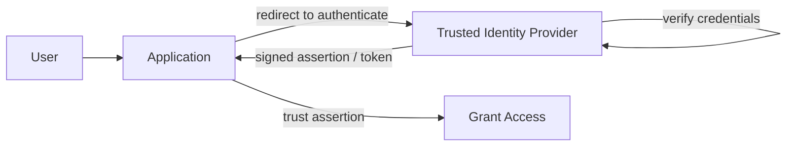

## Diagram

## Summary

Delegates authentication to a trusted external identity provider rather than each application managing credentials itself. The application redirects the user to the IdP, which verifies the user and returns a signed assertion the application trusts. This enables single sign-on across applications and organizational boundaries, and centralizes credential handling, multi-factor enforcement, and account lifecycle in one authority. The pattern is protocol-agnostic — OpenID Connect, SAML, and WS-Federation are concrete implementations.

## When To Use

- Users should authenticate once and access multiple applications without re-entering credentials (SSO)
- Credential management, MFA, and account lifecycle should be centralized rather than duplicated per application
- The system must accept identities from external organizations or consumer providers (partner federation, social login)

## When To Avoid

- A single self-contained application with no cross-app or cross-org identity needs — direct authentication is simpler
- Reliance on an external IdP is unacceptable for availability, and no fallback authentication path exists (pair with Fail Secure)
- Regulatory or trust constraints prohibit delegating authentication to a third party

## Pros and Cons

* Good, because credentials, MFA, and account lifecycle are managed in one authority rather than duplicated across applications
* Good, because users authenticate once and gain access to many applications, improving experience and reducing password sprawl
* Bad, because the identity provider becomes a critical dependency and a single point of failure for all authentication
* Bad, because trust relationships and token/assertion validation must be configured and maintained carefully — misconfiguration is a security risk

## Evolutions

- **From:** Per-application local credential stores with independent logins
- **To:** Claims-Based Identity (carry the federated identity as portable claims across services); Gateway Authentication (validate federated tokens once at the ingress boundary)
