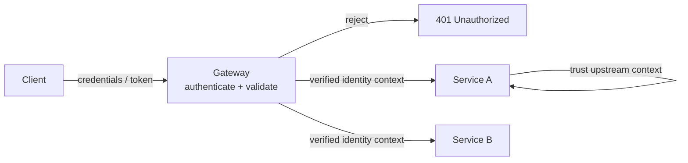

## Diagram

## Summary

Centralizes authentication at a gateway or edge component so individual services do not each implement it. The gateway verifies credentials or tokens once at ingress, rejects unauthenticated requests, and forwards a trusted identity context to downstream services. This removes duplicated, security-sensitive authentication logic from every service, concentrates it where it can be hardened and audited, and lets services focus on business logic. The same offloading applies to TLS termination and token validation.

## When To Use

- Many services would otherwise each implement the same authentication logic
- Authentication should be hardened, audited, and updated in one place rather than across every service
- A single ingress point already exists (API gateway, reverse proxy, service mesh) where verification can be enforced

## When To Avoid

- Downstream services are directly reachable and cannot be constrained to trust only the gateway — the offloaded check can be bypassed
- Services still require their own fine-grained per-request authorization that the gateway cannot express (defense in depth still needed)
- A single-service system where a gateway adds a network hop and operational component for no consolidation benefit

## Pros and Cons

* Good, because authentication logic is consolidated at one hardened, auditable enforcement point instead of duplicated per service
* Good, because services are simplified — they trust a verified identity context rather than re-implementing verification
* Bad, because the gateway becomes a critical trust boundary and single point of failure that must be highly available
* Bad, because if downstream services are reachable directly, the offloaded check can be bypassed — network isolation must back it (see Security Zones, Zero Trust)

## Evolutions

- **From:** Each service implementing its own authentication independently
- **To:** Claims-Based Identity (forward the verified identity as signed claims); Zero Trust (have downstream services re-verify rather than implicitly trust the gateway's context)
