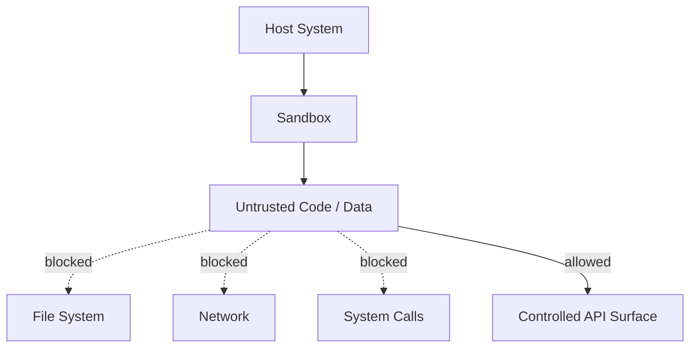

## Diagram

## Summary

Executes untrusted code or processes potentially malicious data within a constrained environment that restricts access to host resources — filesystem, network, system calls, and memory — to an explicitly defined API surface. If the sandboxed code is compromised or malicious, the blast radius is contained to the sandbox. The pattern separates trust levels at the execution boundary rather than at the network boundary.

## When To Use

- The system executes code or processes data from untrusted sources (user-provided scripts, third-party plugins, uploaded files)
- The consequence of a compromised execution must be bounded and not affect the host system
- Different tenants' code must be isolated from each other's execution environment

## When To Avoid

- All executed code is fully trusted and sandbox overhead is unacceptable
- The required API surface is so broad that the sandbox provides no meaningful restriction
- Performance requirements cannot tolerate sandbox isolation overhead

## Pros and Cons

* Good, because malicious or buggy untrusted code cannot affect the host system or other tenants
* Good, because the controlled API surface makes the trust boundary explicit and auditable
* Bad, because sandbox escape vulnerabilities exist — sandboxing reduces risk but does not eliminate it
* Bad, because restricting system calls and resources adds runtime overhead and limits what sandboxed code can do

## Evolutions

- **From:** Direct execution of untrusted code with no isolation
- **To:** Combine with Security Zones (sandbox as a zone boundary for execution); apply within AI systems (ai/llm/tool-use) where LLM-generated code may be executed
