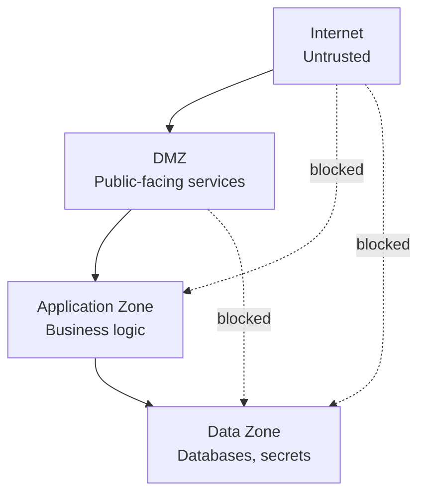

## Diagram

## Summary

Divides a system into distinct areas with explicitly defined trust levels and controlled communication paths between them. Traffic between zones must cross a policy enforcement boundary; direct access from a lower-trust zone to a higher-trust zone is structurally prevented. Classic zones include internet-facing (DMZ), application, and data tiers, but the pattern applies to any grouping of components that share a trust level and should be isolated from others.

## When To Use

- Different components have different exposure profiles (public-facing vs. internal-only vs. sensitive data)
- A breach in one component should not grant access to all others — lateral movement must be constrained
- Compliance requirements mandate isolation between tiers (e.g., separating systems that handle payment data from those that don't)

## When To Avoid

- Flat systems with a single trust level where all components are equivalent (e.g., a fully internal batch pipeline)
- Over-segmentation that creates more enforcement points than the team can maintain and audit

## Pros and Cons

* Good, because a compromised component in one zone cannot directly access components in higher-trust zones
* Good, because security policy is expressed as structural boundaries rather than per-component configuration
* Bad, because inter-zone communication adds latency at every enforcement point
* Bad, because zone boundaries must evolve as the system grows — stale zone definitions create false security

## Evolutions

- **From:** Flat network topology with no explicit trust boundaries
- **To:** Apply Zero Trust at zone boundaries for per-request verification; use Sandboxing within zones for executing untrusted code
