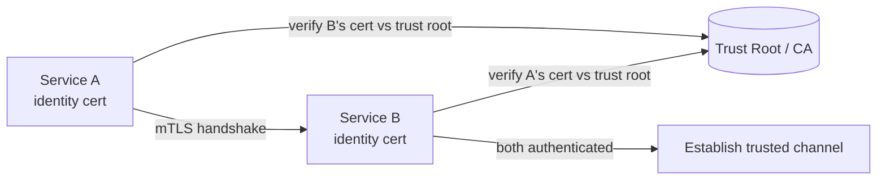

## Diagram

## Summary

Gives each workload a cryptographically verifiable identity so services authenticate each other rather than trusting the network. Each service presents a certificate (or signed identity document) that peers validate against a shared trust root, typically via mutual TLS. Identities are issued and rotated automatically by an identity authority (SPIFFE/SPIRE, a service mesh, or a cloud workload-identity system). This replaces implicit network trust and long-lived shared secrets with per-workload, short-lived, attestable identity — the authentication substrate for Zero Trust between services.

## When To Use

- Services must authenticate each other, not assume trust from network location (Zero Trust foundation)
- Long-lived shared secrets or API keys between services are a liability and should be replaced with rotating identities
- The environment is dynamic (containers, autoscaling) where identity must be issued and rotated automatically

## When To Avoid

- A single-process monolith with no service-to-service calls to authenticate
- The operational capability to run a certificate authority and automated rotation does not exist and cannot be adopted
- Latency-critical internal paths where the mTLS handshake overhead is unacceptable and isolation provides sufficient control

## Pros and Cons

* Good, because every service call is mutually authenticated, eliminating implicit network trust and enabling Zero Trust between workloads
* Good, because short-lived, auto-rotated identities remove long-lived shared secrets and shrink the blast radius of a compromise
* Bad, because it requires an identity authority, certificate issuance, and automated rotation — significant operational machinery
* Bad, because certificate expiry, clock skew, or trust-root misconfiguration can break all inter-service communication at once

## Evolutions

- **From:** Network-location trust or shared static secrets between services
- **To:** Zero Trust (service identity supplies the per-request authentication for policy decisions); Service Mesh (offload mTLS issuance and enforcement to sidecars transparently)
