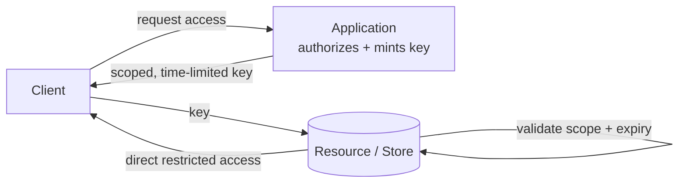

## Diagram

## Summary

Issues a client a scoped, time-limited token that grants direct, restricted access to a specific resource, so the client interacts with the resource without routing every request through the application. The application authenticates and authorizes the request once, then mints a key narrowly constrained to the intended operation, resource, and expiry (e.g. a pre-signed URL granting read of one object for ten minutes). This offloads bulk data transfer from the application while keeping access least-privilege and revocable by expiry.

## When To Use

- Clients need direct access to a resource (typically large-object storage) without proxying data through the application
- Access must be tightly scoped to a specific operation, resource, and time window
- The application should authorize once and then step out of the data path for performance and cost

## When To Avoid

- Fine-grained access must be revocable instantly — keys are valid until expiry unless the store supports revocation
- The resource cannot validate or constrain the key's scope, so over-broad access cannot be prevented
- Requests are small and infrequent — proxying through the application is simpler than minting and validating keys

## Pros and Cons

* Good, because the application authorizes once and then leaves the data path, offloading bandwidth and reducing latency and cost
* Good, because access is least-privilege — the key is constrained to a specific operation, resource, and expiry
* Bad, because a leaked key grants access until it expires — instant revocation requires store-side support or short TTLs
* Bad, because scoping and signing keys correctly is security-sensitive; an over-broad or long-lived key is a direct exposure

## Evolutions

- **From:** Proxying all resource access through the application, which sits in every data request
- **To:** Claims-Based Identity (encode scope and constraints as signed claims in the key); Zero Trust (require the resource to validate every key against current policy rather than trust it implicitly)
