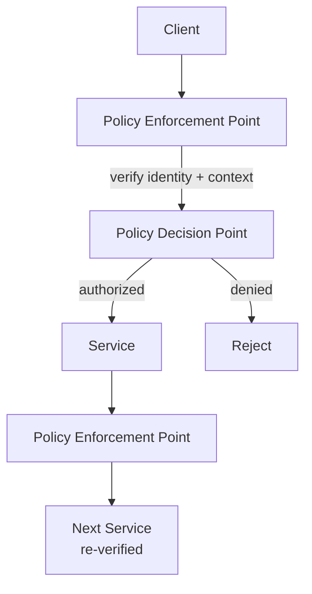

## Diagram

## Summary

Eliminates implicit trust based on network location — no request is trusted because it originates from inside the corporate network or a "trusted" zone. Every request is authenticated and authorized explicitly, regardless of its source. Trust is established per-request based on identity, device posture, and context, not on network topology. This shifts security from perimeter defense to continuous verification at every access point.

## When To Use

- The system spans environments where a network perimeter cannot be reliably defined (cloud, remote access, multi-cloud)
- Lateral movement within the network must be prevented — a compromised internal component should not grant access to others
- Security posture must be verifiable and auditable at every access point

## When To Avoid

- Truly air-gapped systems with physically enforced perimeters and no external connectivity
- Early-stage systems where the complexity of per-request verification would impede development before security requirements are defined

## Pros and Cons

* Good, because a compromised internal component cannot move laterally without re-authenticating at each boundary
* Good, because security posture is consistent regardless of whether requests originate inside or outside a network perimeter
* Bad, because every access point requires an enforcement and decision component — significant architectural and operational investment
* Bad, because policy management becomes complex at scale — overly broad policies defeat the purpose; overly narrow ones create friction

## Evolutions

- **From:** Perimeter-based security (trust the network, not the request)
- **To:** Implement Security Zones to define the boundaries at which policy is enforced; use Claims-Based Identity to carry portable authorization context across services
